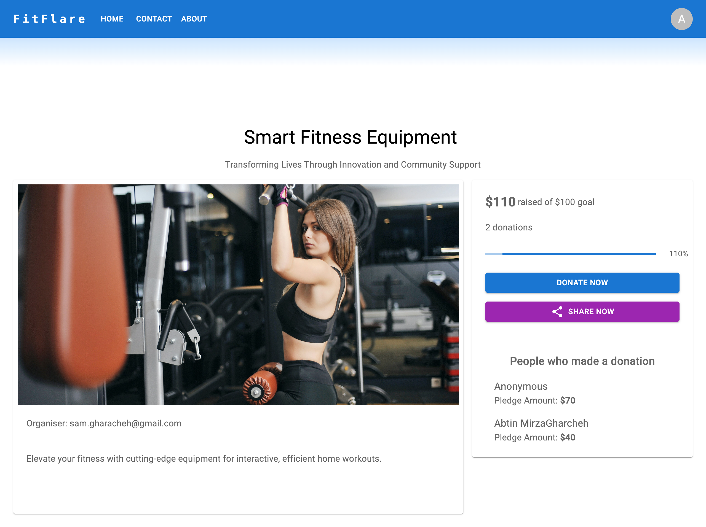
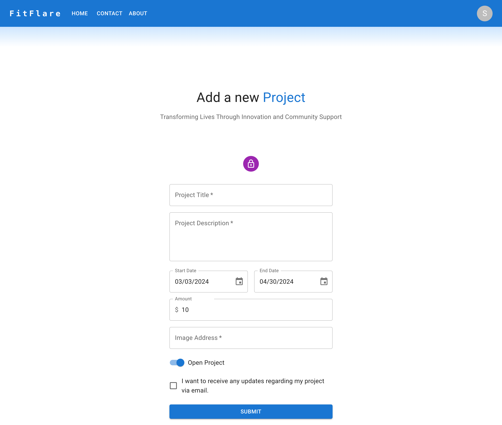
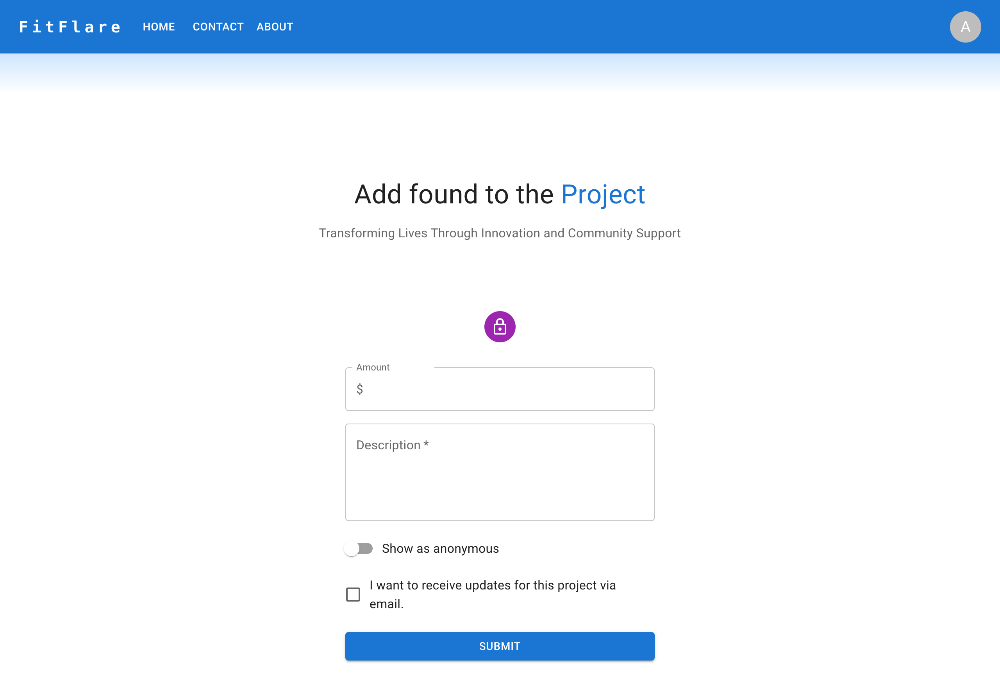
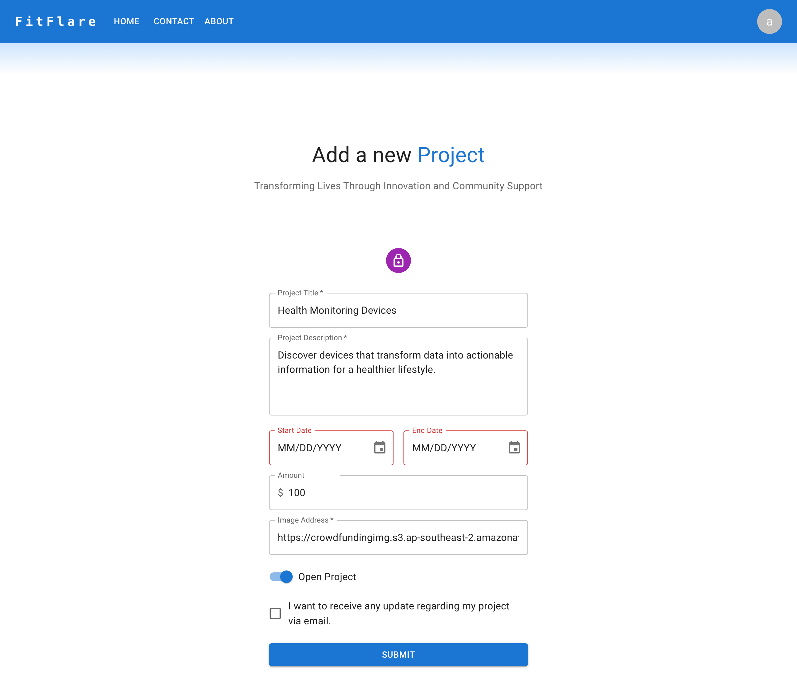
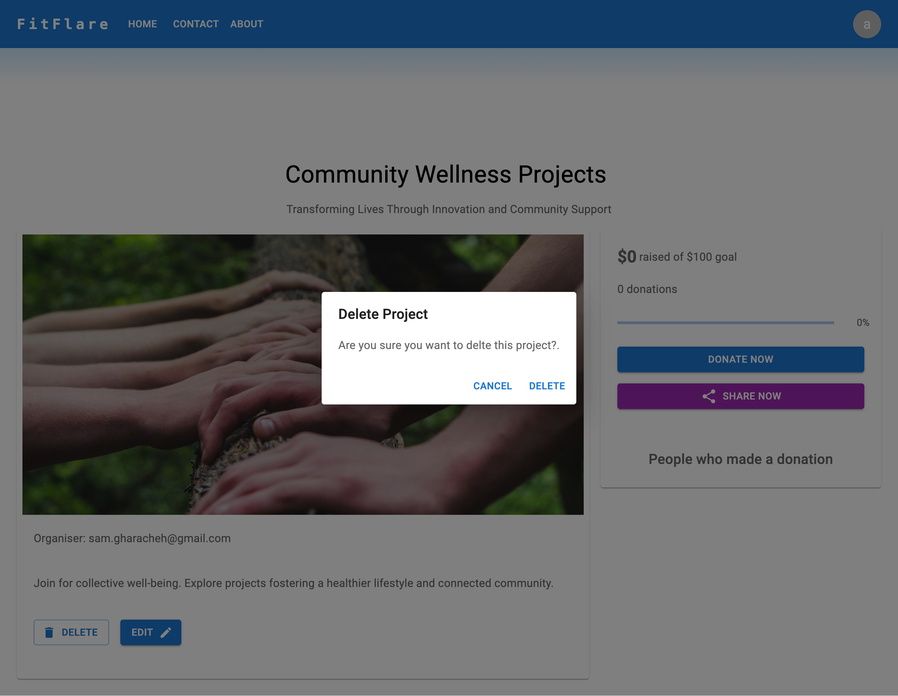
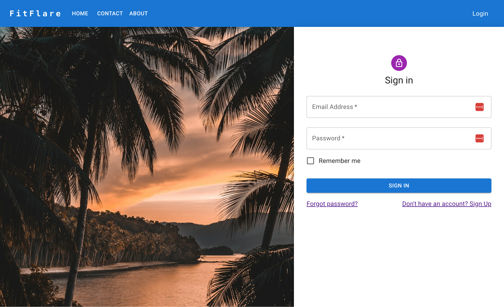
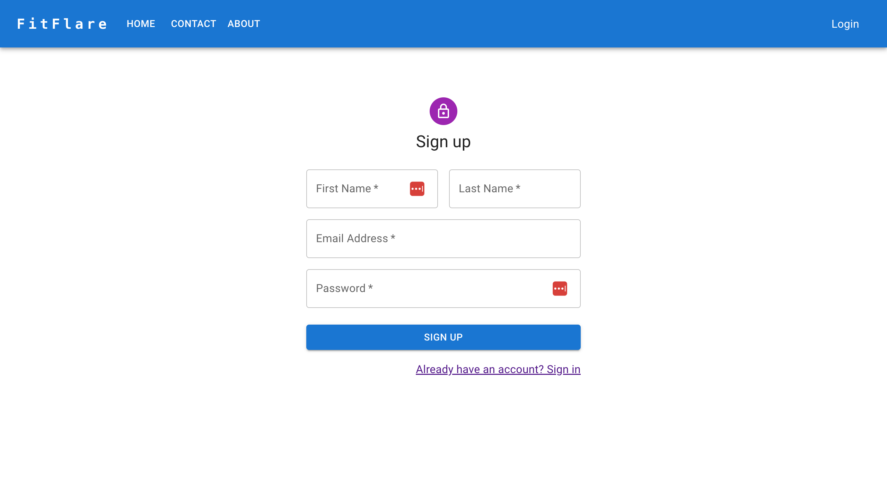

# Crowdfunding Front-End(React-JavaScript)

## FitFlare By Sahar Kavousi

### Deployed Project Link:

https://gleeful-sunshine-a78ad4.netlify.app/

This is a health and fitness crowdfunding site that allows people to ask for sponsership for a variety of innovations, spanning wearable devices, smart fitness equipment, nutritional supplements, wellness apps, and more. 

## Project Requirements

[x] Be separated into two distinct projects: an API built using the Django RestFramework and a website built using React.

[x] Have a cool name, bonus points if it includes a pun and/or missing vowels. 

[x] Have a clear target audience.

[x] Have user accounts. A user should have at least the following attributes:
 
    [x] Username
    [x] Email address
    [x] Password

[x] Ability to create a “project” to be crowdfunded which will include at least thefollowing attributes:

    [x] Title
    [x] Owner (a user)
    [x] Description
    [x] Image
    [x] Target amount to fundraise
    [x] Whether it is currently open to accepting new supporters or not
    [x] When the project was created

[x] Ability to “pledge” to a project. A pledge should include at least the following attributes:

    [x] An amount
    [x] The project the pledge is for
    [x] The supporter/user (i.e. who created the pledge)
    [x] Whether the pledge is anonymous or not
    [x] A comment to go along with the pledge

[x] Implement suitable update/delete functionality, e.g. should a project owner be allowed to update a project description?

[x] Implement suitable permissions, e.g. who is allowed to delete a pledge?

[ ] Return the relevant status codes for both successful and unsuccessful requests to the API.

[ ] Handle failed requests gracefully (e.g. you should have a custom 404 page rather than the default error page).

[x] Use Token Authentication.

[x] Implement responsive design.

## Screenshots

### A screenshot of the home page

### A screenshot of the project deatail page with pledges

### A screenshot of the project creation form

### A screenshot of pledging for a project

### A screenshot of Edit a project 
Displaying the Edit button if user is admin of that project.

### A screenshot of Delete a project
Displaying the Delete button if user is admin of that project.

### A screenshot of Login form 

### A screenshot of Signup form

